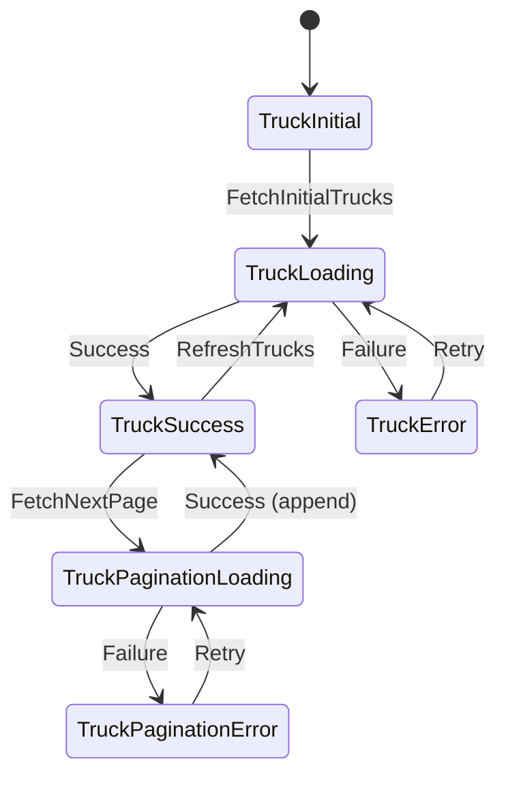

# Design Document: Truck Listing Screen

## Overview

The Truck Listing Screen is a production-quality Flutter feature that implements a paginated, interactive list of available trucks for freight transportation. This design follows Clean Architecture principles with clear separation between data, domain, and presentation layers, using flutter_bloc for state management.

### Key Design Decisions

1. **Clean Architecture**: Strict layer separation ensures testability and maintainability
2. **flutter_bloc**: Provides predictable state management with clear event-state flow
3. **Mock API with Realistic Behavior**: Simulates network delays and failures for robust error handling
4. **Pagination Strategy**: Load 10 trucks per page to optimize performance and memory usage
5. **Component-Based UI**: Each UI element is a separate, reusable widget for maintainability
6. **Centralized Resources**: All strings, sizes, and styles managed through StringManager, SizeManager, and AppTheme
7. **Optimistic Rendering**: Use ListView.builder and const constructors for smooth scrolling

### Architecture Layers

```
presentation/
├── bloc/           # State management
├── screens/        # Main screen
└── widgets/        # Reusable UI components

domain/
├── entities/       # Business models
├── repositories/   # Repository interfaces
└── usecases/       # Business logic

data/
├── models/         # Data models with JSON serialization
├── datasources/    # Mock API service
└── repositories/   # Repository implementations
```

## Architecture

### Layer Responsibilities

**Presentation Layer**:
- Manages UI state through TruckBloc
- Renders truck cards, loading states, and error states
- Handles user interactions (scroll, pull-to-refresh, tap events)
- Dispatches events to bloc and reacts to state changes

**Domain Layer**:
- Defines Truck entity (pure business model)
- Defines TruckRepository interface (abstraction)
- Implements GetTrucksUseCase (business logic)
- Independent of Flutter and external frameworks

**Data Layer**:
- Implements TruckModel with JSON serialization
- Implements MockTruckApiService with simulated network behavior
- Implements TruckRepositoryImpl delegating to data source
- Handles data transformation and error mapping


### State Flow Diagram



### Data Flow

```
User Action → Event → Bloc → UseCase → Repository → DataSource
                ↓
            State Update
                ↓
            UI Rebuild
```

## Components and Interfaces

### Domain Layer

#### Truck Entity

```dart
class Truck extends Equatable {
  final String id;
  final String model;
  final String company;
  final double pricePerDay;
  final double pricePerHour;
  final double capacityTons;
  final TruckType type;
  final String location;
  final double radiusKm;
  final String imageUrl;
  final bool isAvailable;

  const Truck({
    required this.id,
    required this.model,
    required this.company,
    required this.pricePerDay,
    required this.pricePerHour,
    required this.capacityTons,
    required this.type,
    required this.location,
    required this.radiusKm,
    required this.imageUrl,
    required this.isAvailable,
  });

  @override
  List<Object?> get props => [id, model, company, pricePerDay, pricePerHour, 
                               capacityTons, type, location, radiusKm, 
                               imageUrl, isAvailable];
}

enum TruckType { flatbed, refrigerated, dryVan }
```


#### TruckRepository Interface

```dart
abstract class TruckRepository {
  Future<Either<Failure, List<Truck>>> fetchTrucks(int page);
}
```

#### GetTrucksUseCase

```dart
class GetTrucksUseCase extends BaseUseCase<List<Truck>, int> {
  final TruckRepository repository;

  GetTrucksUseCase(this.repository);

  @override
  Future<Either<Failure, List<Truck>>> call(int page) async {
    return await repository.fetchTrucks(page);
  }
}
```

### Data Layer

#### TruckModel

```dart
class TruckModel extends Truck {
  const TruckModel({
    required super.id,
    required super.model,
    required super.company,
    required super.pricePerDay,
    required super.pricePerHour,
    required super.capacityTons,
    required super.type,
    required super.location,
    required super.radiusKm,
    required super.imageUrl,
    required super.isAvailable,
  });

  factory TruckModel.fromJson(Map<String, dynamic> json) {
    return TruckModel(
      id: json['id'] as String,
      model: json['model'] as String,
      company: json['company'] as String,
      pricePerDay: (json['pricePerDay'] as num).toDouble(),
      pricePerHour: (json['pricePerHour'] as num).toDouble(),
      capacityTons: (json['capacityTons'] as num).toDouble(),
      type: TruckType.values.byName(json['type'] as String),
      location: json['location'] as String,
      radiusKm: (json['radiusKm'] as num).toDouble(),
      imageUrl: json['imageUrl'] as String,
      isAvailable: json['isAvailable'] as bool,
    );
  }

  Map<String, dynamic> toJson() {
    return {
      'id': id,
      'model': model,
      'company': company,
      'pricePerDay': pricePerDay,
      'pricePerHour': pricePerHour,
      'capacityTons': capacityTons,
      'type': type.name,
      'location': location,
      'radiusKm': radiusKm,
      'imageUrl': imageUrl,
      'isAvailable': isAvailable,
    };
  }
}
```


#### MockTruckApiService

```dart
class MockTruckApiService {
  static const int trucksPerPage = 10;
  static const int totalTrucks = 50;
  final bool simulateFailures;
  final Random _random = Random();

  MockTruckApiService({this.simulateFailures = false});

  Future<List<TruckModel>> fetchTrucks(int page) async {
    // Simulate network delay
    final delay = 500 + _random.nextInt(1000); // 500-1500ms
    await Future.delayed(Duration(milliseconds: delay));

    // Simulate random failures (20% chance)
    if (simulateFailures && _random.nextDouble() < 0.2) {
      throw NetworkException('Failed to fetch trucks');
    }

    // Calculate pagination
    final startIndex = (page - 1) * trucksPerPage;
    final endIndex = min(startIndex + trucksPerPage, totalTrucks);

    if (startIndex >= totalTrucks) {
      return [];
    }

    // Generate mock trucks for this page
    return List.generate(
      endIndex - startIndex,
      (index) => _generateMockTruck(startIndex + index),
    );
  }

  TruckModel _generateMockTruck(int index) {
    // Generate diverse mock data
    final models = ['Isuzu FRR', 'Hino 500', 'Mercedes Actros', 'Volvo FH', 'MAN TGX'];
    final companies = ['Swift Logistics', 'Prime Transport', 'Eagle Freight', 'Atlas Carriers'];
    final types = TruckType.values;
    final locations = ['Addis Ababa', 'Adama', 'Hawassa', 'Bahir Dar', 'Mekelle'];

    return TruckModel(
      id: 'truck_$index',
      model: models[index % models.length],
      company: companies[index % companies.length],
      pricePerDay: 5000 + (index % 10) * 500,
      pricePerHour: 250 + (index % 10) * 25,
      capacityTons: 5 + (index % 15).toDouble(),
      type: types[index % types.length],
      location: locations[index % locations.length],
      radiusKm: 30 + (index % 5) * 10,
      imageUrl: 'https://example.com/truck_$index.jpg',
      isAvailable: index % 3 != 0, // 2/3 available
    );
  }
}
```

#### TruckRepositoryImpl

```dart
class TruckRepositoryImpl implements TruckRepository {
  final MockTruckApiService apiService;

  TruckRepositoryImpl(this.apiService);

  @override
  Future<Either<Failure, List<Truck>>> fetchTrucks(int page) async {
    try {
      final trucks = await apiService.fetchTrucks(page);
      return Right(trucks);
    } on NetworkException catch (e) {
      return Left(NetworkFailure(e.message));
    } catch (e) {
      return Left(UnexpectedFailure('An unexpected error occurred'));
    }
  }
}
```


### Presentation Layer

#### TruckBloc Events

```dart
abstract class TruckEvent extends Equatable {
  @override
  List<Object?> get props => [];
}

class FetchInitialTrucks extends TruckEvent {}

class RefreshTrucks extends TruckEvent {}

class FetchNextPage extends TruckEvent {}
```

#### TruckBloc States

```dart
abstract class TruckState extends Equatable {
  @override
  List<Object?> get props => [];
}

class TruckInitial extends TruckState {}

class TruckLoading extends TruckState {}

class TruckSuccess extends TruckState {
  final List<Truck> trucks;
  final int currentPage;
  final bool hasMorePages;

  TruckSuccess({
    required this.trucks,
    required this.currentPage,
    required this.hasMorePages,
  });

  @override
  List<Object?> get props => [trucks, currentPage, hasMorePages];

  TruckSuccess copyWith({
    List<Truck>? trucks,
    int? currentPage,
    bool? hasMorePages,
  }) {
    return TruckSuccess(
      trucks: trucks ?? this.trucks,
      currentPage: currentPage ?? this.currentPage,
      hasMorePages: hasMorePages ?? this.hasMorePages,
    );
  }
}

class TruckError extends TruckState {
  final String message;

  TruckError(this.message);

  @override
  List<Object?> get props => [message];
}

class TruckPaginationLoading extends TruckState {
  final List<Truck> currentTrucks;

  TruckPaginationLoading(this.currentTrucks);

  @override
  List<Object?> get props => [currentTrucks];
}

class TruckPaginationError extends TruckState {
  final List<Truck> currentTrucks;
  final String message;

  TruckPaginationError(this.currentTrucks, this.message);

  @override
  List<Object?> get props => [currentTrucks, message];
}
```


#### TruckBloc Implementation

```dart
class TruckBloc extends Bloc<TruckEvent, TruckState> {
  final GetTrucksUseCase getTrucksUseCase;
  static const int trucksPerPage = 10;

  TruckBloc(this.getTrucksUseCase) : super(TruckInitial()) {
    on<FetchInitialTrucks>(_onFetchInitialTrucks);
    on<RefreshTrucks>(_onRefreshTrucks);
    on<FetchNextPage>(_onFetchNextPage);
  }

  Future<void> _onFetchInitialTrucks(
    FetchInitialTrucks event,
    Emitter<TruckState> emit,
  ) async {
    emit(TruckLoading());
    final result = await getTrucksUseCase(1);
    
    result.fold(
      (failure) => emit(TruckError(failure.message)),
      (trucks) => emit(TruckSuccess(
        trucks: trucks,
        currentPage: 1,
        hasMorePages: trucks.length == trucksPerPage,
      )),
    );
  }

  Future<void> _onRefreshTrucks(
    RefreshTrucks event,
    Emitter<TruckState> emit,
  ) async {
    emit(TruckLoading());
    final result = await getTrucksUseCase(1);
    
    result.fold(
      (failure) => emit(TruckError(failure.message)),
      (trucks) => emit(TruckSuccess(
        trucks: trucks,
        currentPage: 1,
        hasMorePages: trucks.length == trucksPerPage,
      )),
    );
  }

  Future<void> _onFetchNextPage(
    FetchNextPage event,
    Emitter<TruckState> emit,
  ) async {
    final currentState = state;
    if (currentState is! TruckSuccess || !currentState.hasMorePages) {
      return;
    }

    emit(TruckPaginationLoading(currentState.trucks));
    
    final nextPage = currentState.currentPage + 1;
    final result = await getTrucksUseCase(nextPage);
    
    result.fold(
      (failure) => emit(TruckPaginationError(
        currentState.trucks,
        failure.message,
      )),
      (newTrucks) {
        final allTrucks = [...currentState.trucks, ...newTrucks];
        emit(TruckSuccess(
          trucks: allTrucks,
          currentPage: nextPage,
          hasMorePages: newTrucks.length == trucksPerPage,
        ));
      },
    );
  }
}
```


#### UI Widget Components

**TruckListingScreen** (Main Screen):
- Manages ScrollController for pagination detection
- Wraps content in RefreshIndicator for pull-to-refresh
- Uses BlocBuilder to react to state changes
- Displays appropriate widget based on state (shimmer, list, error, empty)

**TruckListView**:
- Uses ListView.builder for efficient rendering
- Renders TruckCard for each truck
- Appends PaginationLoader when loading more pages
- Detects scroll position to trigger pagination

**TruckCard**:
- Displays complete truck information in a Card widget
- Uses InkWell for tap feedback
- Composed of TruckImageSection and TruckInfoSection
- Applies consistent spacing using SizeManager

**TruckImageSection**:
- Displays truck image with ClipRRect for rounded corners
- Overlays availability badge (Available/Busy)
- Uses Stack for badge positioning
- Badge color: green for available, red for busy

**TruckInfoSection**:
- Displays truck model (headline style)
- Displays company name (subtitle style)
- Displays pricing in a row (per day / per hour)
- Displays specs: capacity, type, location with icons
- Displays action buttons based on availability

**ShimmerLoader**:
- Displays 3-5 skeleton cards during initial load
- Uses shimmer animation package or custom gradient animation
- Mimics TruckCard layout structure

**PaginationLoader**:
- Displays CircularProgressIndicator at bottom
- Includes padding for visual separation
- Only shown during pagination loading state

**ErrorRetryWidget**:
- Displays error icon
- Displays error message from state
- Displays retry button
- Centers content vertically and horizontally

**EmptyStateWidget**:
- Displays empty state icon/illustration
- Displays "No trucks available" message
- Displays suggestion text
- Centers content vertically and horizontally

## Data Models

### Truck Entity (Domain)

The Truck entity represents the core business model with these properties:

- **id**: Unique identifier (String)
- **model**: Truck model name (String) - e.g., "Isuzu FRR"
- **company**: Operating company name (String) - e.g., "Swift Logistics"
- **pricePerDay**: Daily rental price (double) - in local currency
- **pricePerHour**: Hourly rental price (double) - in local currency
- **capacityTons**: Load capacity (double) - in metric tons
- **type**: Truck type (TruckType enum) - flatbed, refrigerated, or dryVan
- **location**: Base location (String) - city name
- **radiusKm**: Operating radius (double) - in kilometers
- **imageUrl**: Truck image URL (String)
- **isAvailable**: Availability status (bool) - true if available for booking

### TruckModel (Data)

Extends Truck entity and adds:
- `fromJson` factory constructor for JSON deserialization
- `toJson` method for JSON serialization
- Handles type conversion and null safety

### State Models

**TruckSuccess State**:
- **trucks**: List of Truck entities currently loaded
- **currentPage**: Current page number (starts at 1)
- **hasMorePages**: Boolean indicating if more pages exist

**Error States**:
- **message**: User-friendly error message (String)
- **currentTrucks**: Preserved truck list for pagination errors


## Correctness Properties

*A property is a characteristic or behavior that should hold true across all valid executions of a system—essentially, a formal statement about what the system should do. Properties serve as the bridge between human-readable specifications and machine-verifiable correctness guarantees.*

### Property 1: JSON Serialization Round-Trip

*For any* valid TruckModel instance, serializing it to JSON and then deserializing it back should produce an equivalent TruckModel with all properties preserved.

**Validates: Requirements 1.2**

**Rationale**: This is a round-trip property that ensures data integrity during serialization/deserialization. Serialization is critical for data persistence and network communication, and round-trip testing is the gold standard for validating serializers and parsers.

### Property 2: Mock API Pagination Consistency

*For any* valid page number within the available range (1 to 5), the Mock API should return exactly 10 trucks, and for the last page or out-of-range pages, it should return fewer than 10 or zero trucks respectively.

**Validates: Requirements 1.4**

**Rationale**: This is an invariant property that ensures consistent pagination behavior. The API must reliably return the expected number of items per page for proper pagination UX.

### Property 3: UseCase Repository Delegation

*For any* page number, when GetTrucksUseCase is called, it should delegate to the repository's fetchTrucks method with the same page number and return the repository's result unchanged (whether success or failure).

**Validates: Requirements 2.2, 2.3, 2.4**

**Rationale**: This property validates that the use case correctly acts as a pass-through layer, maintaining the Either<Failure, List<Truck>> contract. It ensures proper separation of concerns where the use case doesn't modify or intercept the repository's response.

### Property 4: Bloc State Transition Correctness

*For any* TruckBloc starting from TruckInitial state, when FetchInitialTrucks event is dispatched, the bloc should emit TruckLoading state first, then either TruckSuccess (with trucks, page=1, hasMorePages based on result length) or TruckError (with error message) depending on the use case result.

**Validates: Requirements 3.3, 3.7**

**Rationale**: This property ensures the bloc follows the correct state machine transitions. State management correctness is critical for predictable UI behavior and proper error handling.

### Property 5: Bloc Refresh Resets State

*For any* TruckBloc in TruckSuccess state with any page number and truck list, when RefreshTrucks event is dispatched, the resulting TruckSuccess state should have currentPage=1 and a fresh truck list (not appended to the previous list).

**Validates: Requirements 3.4**

**Rationale**: This property validates the refresh behavior correctly resets pagination state. This is an idempotence-like property ensuring refresh always returns to the initial state.

### Property 6: Bloc Pagination Appends Trucks

*For any* TruckBloc in TruckSuccess state with hasMorePages=true, when FetchNextPage event is dispatched and succeeds, the resulting TruckSuccess state should contain all previous trucks plus the new trucks appended, with currentPage incremented by 1.

**Validates: Requirements 3.5**

**Rationale**: This is an invariant property ensuring pagination correctly accumulates results. The list should grow monotonically, and the page counter should increment correctly.

### Property 7: Bloc Pagination Respects Boundaries

*For any* TruckBloc in TruckSuccess state with hasMorePages=false, when FetchNextPage event is dispatched, the bloc should not emit any new states and should maintain the current state unchanged.

**Validates: Requirements 3.6**

**Rationale**: This property validates boundary conditions in pagination. Preventing unnecessary API calls when no more data exists is critical for performance and user experience.

### Property 8: Scroll Position Triggers Pagination

*For any* scroll position value, when the scroll position is within 200 pixels of the maximum scroll extent, the pagination trigger logic should return true, otherwise false.

**Validates: Requirements 9.1**

**Rationale**: This is a threshold property that ensures pagination triggers at the correct scroll position. This provides smooth infinite scroll UX without premature or delayed loading.


## Error Handling

### Error Types

**NetworkFailure**:
- Occurs when Mock API simulates network errors
- Message: "Failed to fetch trucks" or "Network connection error"
- User-facing message: "Unable to connect. Please check your connection and try again."

**UnexpectedFailure**:
- Occurs for unexpected exceptions
- Message: "An unexpected error occurred"
- User-facing message: "Something went wrong. Please try again."

### Error Handling Strategy

**Initial Load Failure**:
- Bloc emits TruckError state
- UI displays ErrorRetryWidget with full-screen error message
- User can tap retry button to dispatch FetchInitialTrucks again
- No trucks are displayed

**Pagination Failure**:
- Bloc emits TruckPaginationError state with current trucks preserved
- UI displays error message at bottom of list
- User can tap retry button to dispatch FetchNextPage again
- Existing trucks remain visible

**Refresh Failure**:
- Bloc emits TruckError state
- UI displays error via Snackbar or Toast
- Existing trucks are cleared (since refresh resets state)
- User can pull-to-refresh again or tap retry

### Error Recovery

All error states provide retry mechanisms:
1. **ErrorRetryWidget**: Full-screen retry for initial load failures
2. **Inline retry**: Bottom-of-list retry for pagination failures
3. **Pull-to-refresh**: Natural retry mechanism for refresh failures

### Error Message Mapping

```dart
String _mapFailureToMessage(Failure failure) {
  if (failure is NetworkFailure) {
    return StringManager.networkError;
  } else if (failure is UnexpectedFailure) {
    return StringManager.unexpectedError;
  } else {
    return StringManager.genericError;
  }
}
```

## Testing Strategy

### Dual Testing Approach

This feature requires both **unit tests** and **property-based tests** for comprehensive coverage:

- **Unit tests**: Verify specific examples, edge cases, and error conditions
- **Property tests**: Verify universal properties across all inputs
- Both are complementary and necessary for production-quality code

### Unit Testing

**Focus Areas**:
- Specific examples demonstrating correct behavior
- Edge cases (empty lists, last page, first page)
- Error conditions (network failures, invalid data)
- Integration points between layers
- Widget rendering with specific states

**Example Unit Tests**:
- TruckModel.fromJson with valid JSON returns correct model
- TruckModel.fromJson with invalid JSON throws exception
- MockTruckApiService returns empty list for page beyond range
- TruckBloc emits TruckError when use case returns failure
- TruckCard displays "Available" badge when isAvailable=true
- TruckCard displays "Notify When Free" button when isAvailable=false

**Balance**: Avoid writing too many unit tests. Property-based tests handle covering lots of inputs. Unit tests should focus on specific examples and integration points.

### Property-Based Testing

**Library**: Use `test` package with custom property test helpers, or consider `dart_check` for property-based testing in Dart.

**Configuration**:
- Minimum 100 iterations per property test
- Each property test must reference its design document property
- Tag format: `@Tags(['feature:truck-listing-screen', 'property:N'])`

**Property Test Implementation**:

Each correctness property from the design must be implemented as a property-based test:

1. **Property 1 - JSON Round-Trip**:
   - Generate random TruckModel instances
   - Serialize to JSON, deserialize back
   - Assert equality

2. **Property 2 - Pagination Consistency**:
   - Generate random valid page numbers
   - Call Mock API
   - Assert result length is 10 (or less for last page)

3. **Property 3 - UseCase Delegation**:
   - Generate random page numbers
   - Mock repository responses
   - Assert use case returns repository result unchanged

4. **Property 4 - Bloc State Transitions**:
   - Generate random use case results (success/failure)
   - Dispatch FetchInitialTrucks
   - Assert correct state sequence

5. **Property 5 - Bloc Refresh**:
   - Generate random initial states with various pages
   - Dispatch RefreshTrucks
   - Assert page resets to 1 and list is fresh

6. **Property 6 - Bloc Pagination Append**:
   - Generate random TruckSuccess states with hasMorePages=true
   - Dispatch FetchNextPage
   - Assert trucks are appended and page increments

7. **Property 7 - Bloc Pagination Boundary**:
   - Generate TruckSuccess states with hasMorePages=false
   - Dispatch FetchNextPage
   - Assert state unchanged

8. **Property 8 - Scroll Trigger**:
   - Generate random scroll positions
   - Test pagination trigger logic
   - Assert correct true/false based on 200px threshold

### Test Organization

```
test/
├── feature/
│   └── freight/
│       └── truck_listing/
│           ├── data/
│           │   ├── models/
│           │   │   └── truck_model_test.dart
│           │   ├── datasources/
│           │   │   └── mock_truck_api_service_test.dart
│           │   └── repositories/
│           │       └── truck_repository_impl_test.dart
│           ├── domain/
│           │   └── usecases/
│           │       └── get_trucks_usecase_test.dart
│           └── presentation/
│               ├── bloc/
│               │   └── truck_bloc_test.dart
│               └── widgets/
│                   ├── truck_card_test.dart
│                   └── truck_list_view_test.dart
└── helpers/
    └── property_test_helpers.dart
```

### Coverage Goals

- **Unit test coverage**: 80%+ for business logic
- **Property test coverage**: All 8 correctness properties implemented
- **Widget test coverage**: Key UI components (TruckCard, ErrorRetryWidget, EmptyStateWidget)
- **Integration test coverage**: Full user flows (initial load, refresh, pagination)

### Testing Best Practices

1. **Arrange-Act-Assert**: Structure all tests clearly
2. **Test isolation**: Each test should be independent
3. **Mock external dependencies**: Use mocks for repositories and use cases in bloc tests
4. **Descriptive test names**: Use clear, descriptive names that explain what is being tested
5. **Property test tags**: Tag all property tests with feature name and property number
6. **Fast execution**: Keep tests fast (< 5 seconds for full suite)
